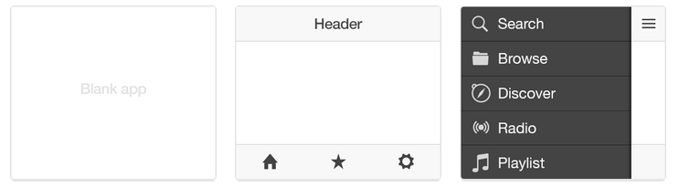

title: PRACTICA FINAL IMPLANTACIÓN DE APLICACIONES WEB 
author: Sebastián & Francisco Javier. (IES Virgen del Carmen)

## PRACTICA FINAL IMPLANTACIÓN DE APLICACIONES WEB 

```
APLICACIÓN CREADA POR IONIC Y CORDOVA
IMPLEMENTADA CON DOCKERS


SEBASTIÁN BERDONCES AGUDO
			Y
FRANCISCO JAVIER BLAZQUEZ CATENA
```

## Índice

- 1  Introducción
- 2  Componentes necesarios
- 3  Instalación
- 4  Creando nuestro primer proyecto
- 5  Arquitectura de la aplicación
- 6  Componentes
- 7  Construyendo la apk
- 8  Documentación

## 1. Introdución

```
Ionic es un framework construido usando HTML5, CSS3 y Javascript para el desarrollo de aplicaciones híbridas para dispositivos móviles. La librería está orientada únicamente a su visualización en dispositivos móviles, es decir, no es una librería responsive como Bootstrap que se adapte a distintos tamaños de pantalla.
```
## 1. Introdución
```
Ionic incluye una completa librería de componentes, estilos y animaciones que simulan el aspecto nativo de las distintas plataformas. Estos componentes adoptarán automáticamente la apariencia nativa del dispositivo en el que si visualicen. Por ejemplo, si incluimos un checkbox en un formulario, al compilar y visualizar dicha aplicación en Android, el checkbox adoptará un aspecto distinto al que mostraría en iOS.
```
## 2. Componentes necesarios

- IONIC 3
- CORDOVA
- ANDROID SDK Y BUILD TOOLS
- ANGULAR JS
- DOCKERS


## 2. Componentes necesarios
####CORDOVA
Apache Cordova es un marco de desarrollo móvil de código abierto. Permite utilizar las tecnologías estándar web como HTML5, CSS3 y JavaScript para desarrollo multiplataforma, evitando el lenguaje de desarrollo nativo de cada plataforma móvil.
Ionic, gracias a que viene integrado con Cordova, también permite el acceso a las características nativas de los dispositivos. Es decir, desde el código web podremos hacer uso de los sensores del dispositivo como GPS, cámara...

## 2. Componentes necesarios
#### android sdk y build tools
Instalar el SDK de Android nos permite principalmente crear aplicaciones para Android. Desde las más sencillas hasta cualquiera que nuestros conocimientos de programación nos permitan. Las API de Android facilitan la tarea y la propia herramienta de Android Studio (Editor) nos deja descargar decenas apps de código abierto para que veamos cómo funciona todo.

Cuando escribimos una aplicación podemos verla en directo gracias al Android Instant Run, un emulador rápido que aplica los cambios sin necesidad de compilar la aplicación.

## 2. Componentes necesarios
#### Angular
Angular es un framework de desarrollo para JavaScript creado por Google. La finalidad de Angular es facilitarnos el desarrollo de aplicaciones web y además darnos herramientas para trabajar con los elementos de una web de una manera más sencilla y optima.
Otro propósito que tiene Angular es la separación completa entre el front-end y el back-end en una aplicación web.

## 2. Componentes necesarios
#### Dockers
La idea detrás de Docker es crear contenedores ligeros y portables para las aplicaciones software que puedan ejecutarse en cualquier máquina con Docker instalado, independientemente del sistema operativo que la máquina tenga por debajo, facilitando así también los despliegues.

## 3. Instalación
```
En primer lugar tenemos que instalar en gestor de paquetes de NodeJs (npm) para poder instalar el propio Ionic y algunas otras dependencias que nos harán falta.
- sudo apt-get install nodejs
- sudo apt-get install npm
```
```
Instalar la última versión de Ionic y Cordova
- sudo npm install -g cordova 
- sudo npm install -g ionic
```
```
Instalar android sdk y build tools
```

Y todo esto lo metimos en un contenedor Dockers listo para funcionar y compilar 


```
Enlace al contenedor Dockers:

docker build -t beevelop/ionic github.com/beevelop/docker-ionic 
```

## 4. Creando nuestro primer proyecto

 Ionic facilita la creación de proyectos, mediante el cual podremos generar proyectos en blanco  y de muchos otros tipos para empezar a programar su contenido desde cero. 
 
 Las opciones de comandos que tenemos son:
 
- ionic start myApp blank

- ionic start myApp tabs

- ionic start myApp sidemenu

- En la version 4 de Ionic

 

## 4. Creando nuestro primer proyecto

Ahora añadiremos la plataforma en la que queramos compilar nuestra aplicacion, en este caso android. 
Entre ellas están Android, iOS, Amazon Fire OS, Blackberry 10, navegador, Firefox OS, Ubuntu, WebOS, Windows Phone 8 y Windows.

El comando seria :
```
ionic platform add nombre-de-la-plataforma
```
Para ver las demas plataformas que haya instaladas seria:
```
ionic platform
```

Y para iniciar un proyecto creado pondremos:
```
ionic serve
```
Y nos iniciaria una pagina en el navegador con la simulacion y se nos abriria el Android Studio, un editor de codigo, para empezar a crear nuestra apk

## 5. Arquitectura de la aplicación
Al generar un nuevo proyecto de Ionic se nos creará una estructura predefinida de carpetas y ficheros que nos permitirán organizar el código de nuestro proyecto. 

   - hooks/ - Esta carpeta se utiliza para añadir scripts que se ejecutarán cuando se produzcan determinados eventos, como por ejemplo antes o después, de la compilación, etc. En la propia carpeta se incluye un fichero con instrucciones para su utilización.
    
   - platforms/ - Contiene el código específico de las plataformas móviles para las cuales se va a compilar, como por ejemplo Android, iOS, etc. El código de esta carpeta es generado y no se ha de modificar manualmente.
    
   -  plugins/ - Contiene los plugins o módulos instalados para nuestra aplicación, los cuales se utilizan para añadir funcionalidad como el acceso a las características nativas del móvil.
    resources/ - Recursos específicos de las plataformas. En esta carpeta podremos colocar aquellos assets que sean únicos o dependientes de una plataforma en concreto.
    
   - scss/ - Código SCSS que será compilado a la carpeta www/css/
    
   - www/  - Contiene el código fuente principal de nuestra aplicación web: HTML, CSS, JavaScript, imágenes, etc. Esta carpeta es donde tendremos que desarrollar la aplicación web de forma centralizada y después utilizarla para la compilación para las distintas plataformas.

    
   - bower.json - Listado de dependencias y paquetes de Bower.
    
   - config.xml - Contiene la configuración de Cordova con las opciones especificas para cada plataformas de compilación.
    
   - ionic.config.json - Configuración del proyecto de Ionic.
    
   -  package.json - Dependencias y paquetes de NodeJS.
   
   
## 5. Arquitectura de la aplicación
   
```
En la carpeta www tendremos los siguientes ficheros:
```
  - css/ - Aquí colocaremos todas las hojas de estilo que se usen en la aplicación.
    
 -  img/ - En esta carpeta almacenaremos las imágenes de nuestro proyecto.
    
   - js/ - Contendrá todo el código JavaScript de la aplicación.
    
  -  lib/ - Aquí guardaremos todas las librerías que se usen en nuestro código. Por defecto ya viene incluido todo el código de la librería Ionic (Javascipts, CSS, etc.) para que lo podamos cargar desde nuestro proyecto.
    
  -  templates/ - Esta carpeta viene preparada para almacenar las plantillas o vistas de la aplicación (en algunas versiones no se crea por defecto).
    
 -   index.html - Este es el fichero principal que se abrirá al cargar la aplicación. Aquí tendremos que cargar todo lo necesario y mostrar el contenido de la primera pantalla.

## 6. Componentes

Los principales componentes que podemos utilizar con ionic para nuestro proyecto son:

   - Área de contenidos
   - Cabeceras
   - Pie de página
   - Botones y enlaces
   - Listados
   - Tarjetas
   - Formularios
   - Tabs o fichas
   - Grid o rejillas
  
## 7. Construyendo la apk

Una vez que ya tenemos todo configurado y puesto en su sitio debemos empezar la compilacion.

Se necesitarian los siguientes comandos:

```
- ionic cordova build -lab: Nos da una vista previa de como quedara la aplicación

- ionic cordova build -prod [Plataforma]:  Optimiza el codigo para mayor rapidez

- ionic cordova build -release [Plataforma]: Hace que la aplicacion pueda ser lanzada a las tiendas 
```

## 8. Documentación

```
   - Primeros pasos: http://ionicframework.com/getting-started/
   - Documentación: http://ionicframework.com/docs/
   - Componentes: http://ionicframework.com/docs/components/
   - API de Ionic: http://ionicframework.com/docs/api/
   - Más documentación como vídeos, trucos, foro, etc. en: http://learn.ionicframework.com/

```

## 8. Codigo QR

```
   - Subimos la aplicacion a https://www.mega.nz
   - Utilizamos la pagina: http://www.codigos-qr.com/generador-de-codigos-qr/
   - Que traduce cualquier URL en una imagen QR que facilita y agiliza el acceso a la aplicación

```


